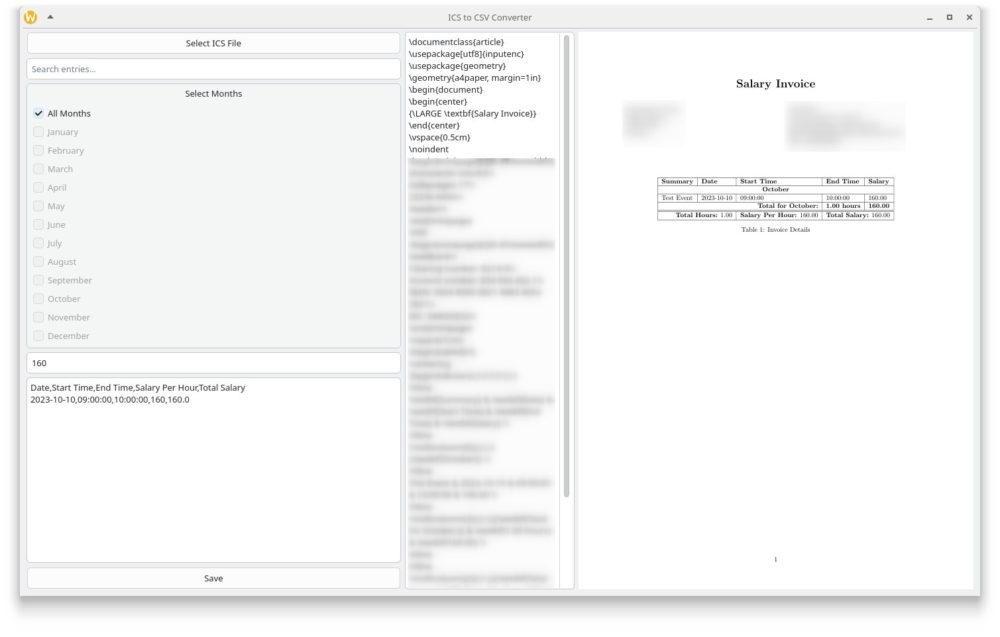

# CalToTex 🗓️➡️📄

CalToTex is an advanced Python application designed to streamline the process of transforming calendar events from `.ics` files into polished LaTeX invoices and CSV files. Featuring an intuitive graphical interface powered by PyQt6, it empowers users to effortlessly filter events, compute earnings based on hourly rates, and generate professional-grade invoices in both LaTeX and PDF formats. Whether you're managing freelance projects or tracking billable hours, CalToTex simplifies your workflow with precision and efficiency.



## Features ✨

- 📥 Import calendar events from `.ics` files.
- 🔍 Filter events by search terms and months.
- 💰 Calculate salaries based on hourly rates.
- 🖋️ Generate invoices in LaTeX and PDF formats.
- 📊 Export event data to CSV files.

## Installation 🛠️

1. Clone the repository:
   ```bash
   git clone https://github.com/your-repo/caltotex.git
   cd caltotex
   ```

2. Install dependencies:
   ```bash
   pip install -r requirements.txt
   ```

3. (Optional) Set up a development environment using Nix:
   ```bash
   nix develop
   ```

## Usage 🚀

1. Run the application:
   ```bash
   python src/main.py
   ```

2. Use the graphical interface to:
   - 📂 Select an `.ics` file.
   - 🔎 Filter events by search terms or months.
   - 💵 Enter your hourly salary.
   - 📄 Preview and save CSV, LaTeX, and PDF files.

## How to Use 🧑‍💻

1. **Open the Application**  
   Launch the application by running the following command in your terminal:
   ```bash
   python src/main.py
   ```

2. **Load a Calendar File**  
   - 📂 Click the "Open" button in the application.
   - Select an `.ics` file from your computer.

3. **Filter Events**  
   - 🔍 Use the search bar to filter events by keywords.
   - 📅 Select specific months to narrow down the events.

4. **Set Hourly Rate**  
   - 💵 Enter your hourly salary in the provided field.

5. **Generate Outputs**  
   - 🖋️ Click the "Generate Invoice" button to create a LaTeX invoice.
   - 📄 Save the invoice as a `.tex` or `.pdf` file.
   - 📊 Export event data to a `.csv` file if needed.

6. **Preview Outputs**  
   - 👀 Use the preview feature to check the generated invoice before saving.

## Development 🛠️

To contribute or modify the project, ensure you have the required dependencies installed. The project uses PyQt6 for the GUI and LaTeX for generating invoices.

## License 📜

This project is licensed under the [GNU General Public License v3.0](LICENSE).